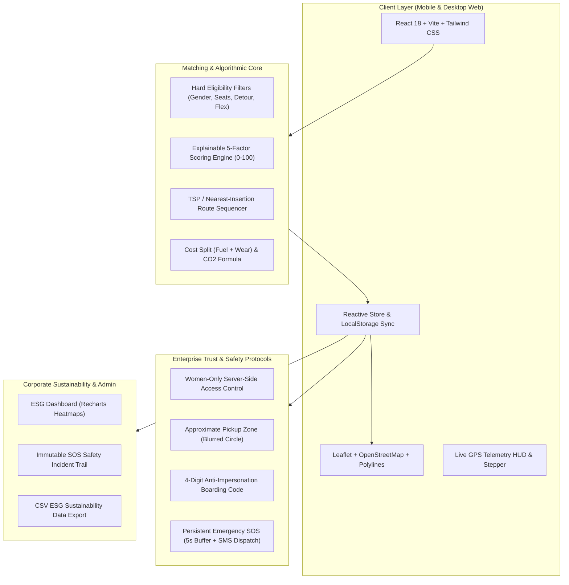

# RideSync — Intelligent Employee Carpooling & Commute Platform

> **Hackathon MVP**: A high-efficiency, mobile-responsive web platform enabling corporate employees to share daily commutes along high-density tech corridors. Built with an explainable AI matching engine, strict server-side women-only safety safeguards, live GPS simulation, OTP boarding verification, and automated corporate ESG sustainability analytics.

---

## 🚀 Live Demo & Presentation Highlights

- **Local Dev Server**: `http://localhost:5173/`
- **1-Click Demo Personas**:
  1. **Ananya Sharma (Host ♀)**: Female Driver, Hyundai i20 (`TS 09 EZ 4082`), 8:30 AM departure to Mindspace HITEC City. Hosts a **Women-Only Safe Commute**.
  2. **Priya Patel (Passenger ♀)**: Female Commuter, Kondapur, 8:35 AM. Scores **91% Match** with explainable reasons.
  3. **Rahul Verma (Passenger ♂)**: Male Commuter, Madhapur. Demonstrates **strict server-enforced safety filtering** (Women-Only rides are completely invisible and unjoinable for non-females).
  4. **Alok Kulkarni (Corporate Admin)**: Workplace Safety & ESG Manager dashboard with live KPIs, corridor heatmaps, CSV exports, and SOS incident logs.
- **Interactive 3-Minute Demo Guide**: Integrated directly into the top banner with step-by-step teleports.

---

## 🏛️ System Architecture



---

## 🧠 Explainable AI Matching Engine

Compatibility is computed through a transparent, weighted 5-factor scoring model that returns a score between 0 and 100 with natural language explanations:

$$\text{Score} = (\text{Route} \times 0.30) + (\text{Time} \times 0.25) + (\text{Distance} \times 0.20) + (\text{Pickup} \times 0.15) + (\text{Detour} \times 0.10)$$

### 1. Factor Formulations:
1. **Route Similarity (Weight 0.30)**:
   - Destination proximity: Within 1.5 km = 100, linearly degrades to 0 at 6.0 km.
   - Blended 50/50 with the perpendicular distance of the passenger's origin to the driver's polyline corridor.
2. **Time Compatibility (Weight 0.25)**:
   - Departure difference $|t_{\text{host}} - t_{\text{passenger}}|$ evaluated against the passenger's allowed flex window ($\pm 15$ to $\pm 30$ mins).
3. **Distance Proximity (Weight 0.20)**:
   - Haversine distance from passenger source to the nearest point on the driver's route ($0\text{ km} = 100$, $5\text{ km} = 0$).
4. **Pickup Convenience (Weight 0.15)**:
   - Walking distance to the suggested safe pickup landmark ($\le 0.5\text{ km} = 100$, $\ge 2.0\text{ km} = 0$).
5. **Detour Overhead (Weight 0.10)**:
   - $\text{Extra km} = \text{Route}(Start \to Pickup \to Dest) - \text{Route}(Start \to Dest)$. $0\text{ km} = 100$, $\ge 5\text{ km} = 0$.

### 2. Hard Eligibility Filters (Evaluated Prior to Scoring):
- **Status & Capacity**: Ride must be in `scheduled` state with `seats_available > 0`.
- **Self-Join Prevention**: Host cannot request to join their own carpool.
- **Strict Women-Only Safety**: If `visibility === 'women_only'`, passenger's profile gender **must strictly be `'female'`**. Non-female requests are rejected and hidden by the engine.
- **Private Team Code**: Rides marked `private` require matching invite codes.
- **Tolerance Exceeded**: Departure time difference must be $\le$ flex window, and detour must be $\le$ maximum allowed detour.

---

## 🛡️ Trust, Privacy & Safety Matrix

| Feature | Mechanism | Hackathon Implementation |
|---|---|---|
| **Women-Only Commutes** | Strict gender verification logic | Server-side and engine-side filtering. Men cannot view or join women-only rides. Pink badge with shield. |
| **Address Privacy** | Blurred approximate pickup zone | Exact residential addresses are withheld from co-riders until ride acceptance. Map renders a 450 m radius privacy circle. |
| **Anti-Impersonation OTP** | 4-digit boarding handshake | Host enters passenger's 4-digit code to confirm boarding before trip status advances to `in_progress`. |
| **Persistent Emergency SOS** | 1-tap activation with 5s cancel window | Persistent red SOS button on active ride screen. 5-second countdown prevents accidental presses. Dispatches simulated SMS to emergency contacts & TechCorp Security Desk. Logged in Admin Audit Trail. |
| **Live Route Telemetry** | Simulated GPS interpolator | Animated vehicle moves along polyline with live countdown of ETA and remaining kilometers. |

---

## 🌿 ESG Emissions & Cost Splitting Formulas

### Cost Split:
- Non-commercial, fair cost sharing among verified employees.
$$\text{Distance Cost} = \text{Distance (km)} \times ₹8\text{ (fuel + wear)}$$
$$\text{Time Cost} = \text{Duration (min)} \times ₹1\text{ (transit overhead)}$$
$$\text{Total Cost} = \text{Distance Cost} + \text{Time Cost}$$
$$\text{Per-Person Share} = \frac{\text{Total Cost}}{\text{Passengers} + 1\text{ (Host)}}$$

### Sustainability Impact:
- **Solo km avoided**: $\text{Distance (km)} \times \text{Passengers}$
- **$\text{CO}_2$ Avoided**: $(\text{Solo km avoided}) \times 0.12\text{ kg/km}$
- **Solo Cab Savings**: Compared against standard city cab rates ($₹24/\text{km}$ with minimum base fare $₹120$).

---

## 🎬 3-Minute Hackathon Demo Script

```
00:00 - 00:30 | STEP 1: HOST A COMMUTE (ANANYA - FEMALE HOST)
- Switch to Ananya (Host ♀).
- Navigate to "Host Ride". Select "Gachibowli -> HITEC City" corridor.
- Select "Women Only" visibility (pink badge). Vehicle: Hyundai i20 (3 seats).
- Click "Host Commute & Open Pickups".

00:30 - 01:00 | STEP 2: FIND & MATCH (PRIYA - FEMALE PASSENGER)
- Switch to Priya (Passenger ♀).
- Navigate to "Find Ride". Pickup: "Kondapur Botanical Garden".
- The Matching Engine computes an 91% match with explainable bullet points:
  "Same office campus", "Departs within 5 mins", "Minimal detour (+0.8 km)".
- Notice the pink "Women-Only" badge. Click "Request Seat".

01:00 - 01:30 | STEP 3: STRICT GENDER SAFETY FILTER (RAHUL - MALE PASSENGER)
- Switch to Rahul (Passenger ♂).
- Navigate to "Find Ride".
- Observe: Ananya's Women-Only ride is COMPLETELY INVISIBLE to Rahul.
- Engine displays privacy banner: "Women-Only rides strictly hidden for male profiles."

01:30 - 02:00 | STEP 4: HOST APPROVES & STOPS ARE SEQUENCED
- Switch back to Ananya (Host ♀).
- Open "Requests". Review Priya's 91% match score and pickup point.
- Click "Accept & Add Stop".
- Seats decrement from 3 to 2. A secret 4-digit OTP is automatically generated!

02:00 - 02:30 | STEP 5: LIVE TRIP, OTP BOARDING & EMERGENCY SOS
- Navigate to "Live Trip".
- View the sequenced stops: Origin -> Pickup Stop (Kondapur) -> Campus Destination.
- Click "Auto-Drive Route" or "+25% Step": Watch car navigate along the polyline.
- Click "Verify Passenger OTP": Enter the 4-digit PIN to verify boarding.
- Click "🚨 SOS EMERGENCY": Observe the 5-second cancel buffer. Let it trigger.
- View simulated SMS dispatch with live GPS coordinates to family & security desk.

02:30 - 03:00 | STEP 6: ADMIN SUSTAINABILITY & ESG ANALYTICS
- Switch to Admin persona. Navigate to "Admin Analytics".
- Inspect real-time ESG metrics: 1,778 kg CO2 avoided, 76.4% seat occupancy, ₹3,55,680 saved.
- View peak commute heatmap (8:30 - 9:00 AM rush hour) and top traffic corridors.
- View the immutable SOS incident log.
- Click "Export ESG CSV Report" to download the compliance CSV.
```

---

## 📊 Short Pitch Deck Outline

### Slide 1: The Problem
- **Gridlock & Stress**: Tech corridors (e.g. HITEC City, Outer Ring Road) suffer from severe single-occupancy vehicle congestion.
- **Safety Concerns**: Women employees hesitate to share rides with strangers without certified trust and gender-specific controls.
- **ESG Pressures**: Enterprises need verifiable corporate Scope 3 commuter emission reductions.

### Slide 2: The Solution — RideSync
- **Intelligent Corridors**: Automatically routes and sequences pickups within tech park clusters.
- **Explainable Matching**: Transparent 0-100 scores explaining detour minutes, walking distances, and shared schedules.
- **Zero-Friction Corporate Trust**: SSO-verified colleagues, anti-impersonation OTPs, and strict women-only options.

### Slide 3: Safety Architecture (Judges' Deep Dive)
- **Engine-Level Gender Protection**: Women-only rides are filtered at the query layer, not just hidden in CSS.
- **Privacy Zones**: Exact home coordinates are blurred until ride confirmation.
- **5-Second SOS Dispatch**: One-tap emergency escalation with live GPS, driver/rider telemetry, and corporate security webhooks.

### Slide 4: Enterprise Impact Numbers (Hyderabad Pilot)
- **14,820 km** single-occupancy travel eliminated.
- **1,778 kg $\text{CO}_2$** emissions prevented.
- **76.4%** average seat occupancy rate.
- **₹3,55,680** commuter fuel and taxi expenses saved.

### Slide 5: Roadmap & Next Milestones
- **Phase 2**: Real-time WebSockets synchronization via Supabase Realtime.
- **Phase 3**: Corporate shuttle & feeder integration for multi-modal last-mile connectivity.
- **Phase 4**: Automated corporate parking-spot incentives for high-frequency carpool hosts.

---

## 🛠️ Tech Stack & Setup Instructions

### Technology Stack:
- **Framework**: React 18 + Vite + TypeScript
- **Styling**: Tailwind CSS + Custom Dark Theme
- **Maps**: Leaflet + React Leaflet + CartoDB Dark Matter Tiles (Zero API key blockers)
- **Charts**: Recharts
- **Icons**: Lucide React
- **Animations & Delight**: Canvas Confetti

### Local Installation:
```bash
# 1. Clone repository
git clone https://github.com/muzammilsd-codes/RideSync.git
cd RideSync

# 2. Install dependencies
npm install

# 3. Run Matching Engine Unit Tests
npx tsx -e "import { runMatchingTests } from './src/matching/__tests__/matching.test.ts'; runMatchingTests();"

# 4. Start Development Server
npm run dev
# Open http://localhost:5173/ in your browser
```

---

## 🧪 Unit Test Suite Verification

The explainable matching engine includes automated test coverage validating core safety and routing scenarios:
- **Test 1**: High-compatibility match (Priya + Ananya): Validates score $\ge 85\%$ and generated reasons.
- **Test 2**: Strict Women-Only Safety Enforcement: Confirms male passenger (Rahul) receives `null` match and is rejected by the hard filter.
- **Test 3**: Private Ride Invite Verification: Confirms team invite codes work as expected.
- **Test 4**: Time Window Flex Filter: Confirms rides outside schedule flex tolerance are excluded.

Run tests anytime with:
```bash
npx tsx -e "import { runMatchingTests } from './src/matching/__tests__/matching.test.ts'; runMatchingTests();"
```
